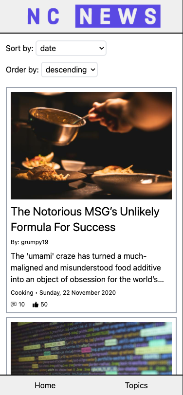

# NC News

This is the frontend project of my Northcoders Software Development Bootcamp.

It is a React app that provides the ability to browse news articles. You can see the entire list of news articles or filter them by topic. You also have the ability to sort and order the results

You can view the deployed version of the app at [NC News](https://nc-news-react-app.netlify.app/).

The app uses the backend provided by my [Northcoders backend project](https://github.com/mikef80/be-nc-news).

## How to use this repo

1. Clone the repo to your local machine using `git clone https://github.com/mikef80/fe-nc-news.git`

2. Navigate to the correct folder using `cd fe-nc-news`

2. Run `npm install` to install all required dependencies
    - Minimum versions required:
      - Node - v20.5.0

3. Run `npm run dev` to run the app locally

## Screenshots

